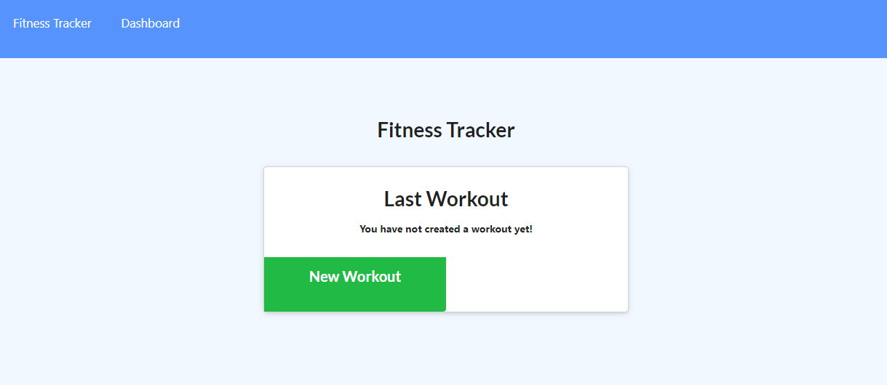

# Deployed App
https://powerful-castle-13273.herokuapp.com/
# Fitness Tracker
## Screenshot
 
 
## Purpose
This app is designed to take in your work-outs and chart them for you based on which workouts you choose.
## Functionality
When you open the app up, you are presented with two choices;
```
Add New Workout,  
Continue Workout
```
After choosing one of the two, you specify Either Resistance or Cardio type workout
Depending on which you choose, there will be different fields for you to fill out, though they are fairly self explanitory
Afterwards you will hit complete and you will then go back to the dashboard and see the results.
## Made by
This project was made 
Evan Ebert - https://github.com/evan-ebert17
